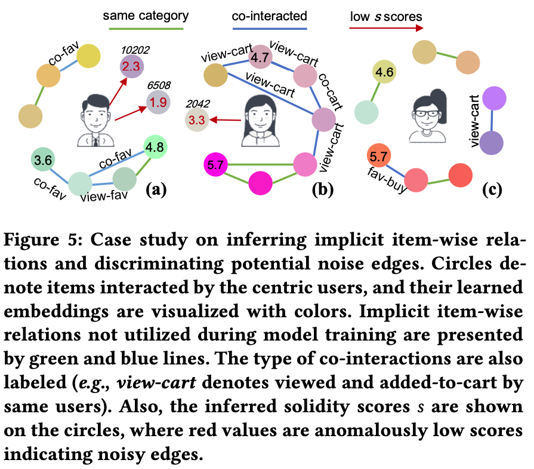

# Self-Supervised Hypergraph Transformer for Recommender Systems

<strong>PyTorch Version is Available Now!</strong>

This repository contains TensorFlow & Torch code scripts and datasets for the paper:
> Lianghao Xia, Chao Huang, Chuxu Zhang (2022). Self-Supervised Hypergraph Transformer for Recommender Systems, <a href='https://arxiv.org/pdf/2207.14338.pdf'>Paper in arXiv</a>, <a href='https://dl.acm.org/doi/pdf/10.1145/3534678.3539473'> Paper in ACM</a>. In KDD'22, Washington DC, USA, August 14-18, 2022.

## Introduction
This paper proposed a hypergraph-enhanced predictive SSL framework named SHT, for relieving the data sparsity and data noise problem in collaborative filtreing. It builds two views, using the local LightGCN and the global Hypergraph Neural Network (HGNN), respectively. And instead of applying the popular Contrastive Learning (CL) paradigm, it proposes a prediction alignment task as the augmented self-supervised learning task (refer to paper or code for details). Experiments show that such method is able to accelarate and supercharge the training process with effective supervision augmentations. Also, the prediction alignment task is shown capable of denoising edges in the observed graph and giving more explainable samples as introduced in our case study in the following figure.



## Citation
Please kindly use the following BibTex if you cite our paper:
```
@inproceedings{sht2022,
  author    = {Xia, Lianghao and
               Huang, Chao and
	       Zhang, Chuxu},
  title     = {Self-Supervised Hypergraph Transformer for Recommender Systems},
  booktitle = {Proceedings of the 28th {ACM} {SIGKDD} Conference on
               Knowledge Discovery and Data Mining, {KDD} 2022, 
	       Washington DC, USA, August 14-18, 2022.},
  year      = {2022},
}
```

## Environment
The code of SHT are implemented and tested under the following development environment:

TensorFlow:
* python=3.7.0
* tensorflow=1.15.0
* numpy=1.21.6
* scipy=1.7.3

PyTorch:
* python=3.10.4
* torch=1.11.0
* numpy=1.22.3
* scipy=1.7.3

## Datasets
Three datasets are adopted to evaluate SHT: <i> Yelp, Gowalla, </i>and <i>Tmall</i>. The user-item pair $(u_i, v_j)$ in the adjacent matrix is set as 1, if user $u_i$ has rated item $v_j$ in Yelp, or if user $u_i$ has check in venue $v_j$ in Gowalla, or if user $u_i$ has purchased item $v_j$ in Tmall. We filtered out users and items with too few interactions.

## Usage
Please unzip the datasets first. Also you need to create the `Models/` directory. The following command lines start training and testing on the three datasets, respectively, which also specify the hyperparameter settings for the reported results in the paper. Training and testing logs for trained models are contained in the `History/` directory.

For the pytorch version, switch your working directory to `torchVersion` and then run the commands as below. The implementation has been simplified and improved, to highlight the effect of the proposed self-supervised learning method.

### TensorFlow
* Yelp
```
python .\labcode_hop.py --data yelp --reg 1e-2 --ssl_reg 1e-5 --mult 1e2 --edgeSampRate 0.1 --epoch 1
```
* Gowalla
```
python .\labcode_hop.py --data gowalla --reg 1e-2 --ssl_reg 1e-5 --mult 1e1 --epoch 150 --edgeSampRate 0.1 --save_path gowalla_repeat
 ```
 * Tmall
```
python .\labcode_hop.py --data tmall --reg 1e-2 --ssl_reg 1e-5 --mult 1e1 --edgeSampRate 0.1 --epoch 150 --save_path tmall_repeat
```

### PyTorch
* Yelp
```
python Main.py --data yelp --ssl1 1 --ssl2 1 --temp 0.2 --reg 3e-7 --edgeSampRate 0.1
```
* Gowalla
```
python Main.py --data gowalla --ssl1 1 --ssl2 1 --temp 0.2 --reg 3e-8 --edgeSampRate 0.1
```
* Tmall
```
python Main.py --data tmall --ssl1 1 --ssl2 1 --temp 0.5 --reg 3e-7 --edgeSampRate 0.01
```

Important arguments:
* `reg`: This is the weight for weight-decay regularization. Empirically recommended tuning range is `{1e-2, 1e-3, 1e-4, 1e-5}`. For the pytorch version, it is tuned from `{1e-8, 3e-8, 1e-7, 3e-7, 1e-6}`.
* `ssl_reg`: This is the weight for the solidity prediction loss of self-supervised learning task. The value is tuned from `{1e-3, 1e-4, 1e-5, 1e-6, 1e-7}`. For the pytorch version, it is split into two hyperparameters `ssl1_reg` and `ssl2_reg`, but in our experiments they are set the same. And it is tuned from `{10, 3, 1, 0.3, 0.1, 0.03}`.
* `mult`: This hyperparameter is to emplify the ssl loss for better performance, which is tuned from `{16, 64, 1e1, 1e2, 1e3}`.
* `edgeSampRate`: This parameter determines the ratio of edges to conduct the solidity differentiation task on. It should be balanced to consider both model performance and training efficiency.

## Achnowledgements
This research work is supported by the research grants from the Department of Computer Science & Musketeers Foundation Institute of Data Science at the University of Hong Kong.
